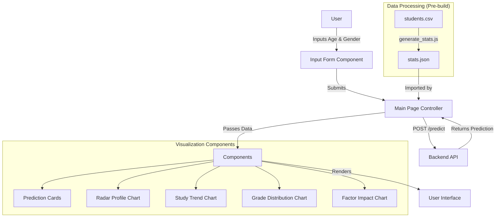

# Student Performance Prediction – Frontend (Next.js)

A Next.js frontend application that predicts student performance and visualizes analytical trends based on demographic and behavioral data.

## Project Architecture



## Setup Instructions

### Prerequisites
- Node.js (v18 or higher recommended)
- npm

### Installation

1. Navigate to the frontend directory:
   ```bash
   cd student-performance-frontend
   ```

2. Install dependencies:
   ```bash
   npm install
   ```

3. (Optional) Regenerate statistics:
   If you modify `data/students.csv`, regenerate the lightweight stats file:
   ```bash
   node scripts/generate_stats.js
   ```

### Running the Application

1. Start the development server:
   ```bash
   npm run dev
   ```

2. Open [http://localhost:3000](http://localhost:3000) in your browser.
---

## Environment Variables

Ensure the following environment variable is set in the `.env.local` file for the frontend:

```env
NEXT_PUBLIC_BACKEND_URL=http://127.0.0.1:8000
```

### Building for Production

1. Build the application:
   ```bash
   npm run build
   ```

2. Start the production server:
   ```bash
   npm start
   ```

## Key Features

- **Performance Prediction**: Predicts GPA, Grade Class, and other metrics based on minimal input.
- **Interactive Visualizations**:
    - **Radar Chart**: Compares the student's profile against the population average.
    - **Trend Analysis**: Visualizes how study time affects GPA.
    - **Distribution**: Shows the prevalence of different grade classes.
    - **Factor Impact**: Analyzes the effect of parental education on performance.
- **Responsive Design**: Optimized for both desktop and mobile devices.

# Student Performance Prediction – Backend (FastAPI + Machine Learning)

## Overview
This backend service provides a machine-learning–powered API to predict a comprehensive student performance profile from minimal demographic inputs. It exposes REST endpoints using FastAPI, trains a multi-output ML model from a CSV dataset, and returns both numerical and categorical predictions in real time.

The system is designed to be production-ready, deployable on platforms like Render, and easily consumable by a modern frontend (e.g., Next.js).

---

## High-Level Architecture

```

┌────────────────┐
│   Frontend     │
│ (Next.js UI)   │
└───────┬────────┘
│ HTTP (REST)
▼
┌──────────────────────────┐
│        FastAPI           │
│  app/main.py             │
│  - CORS Middleware       │
│  - Route Registration    │
└─────────┬────────────────┘
│
▼
┌──────────────────────────┐
│   API Routes Layer       │
│  app/routes/predict.py  │
│  - Input validation     │
│  - Calls ML inference   │
└─────────┬────────────────┘
│
▼
┌──────────────────────────┐
│   ML Inference Layer     │
│  ml/predict.py           │
│  - Load model.pkl        │
│  - Preprocess inputs    │
│  - Decode predictions   │
└─────────┬────────────────┘
│
▼
┌──────────────────────────┐
│   Trained Model Artifact │
│  ml/model/model.pkl      │
│  - MultiOutputRegressor  │
│  - Encoders metadata    │
└──────────────────────────┘
▲
│
┌─────────┴────────────────┐
│   Training Pipeline       │
│  ml/train.py              │
│  - Reads CSV dataset      │
│  - Trains multi-output ML │
│  - Saves model.pkl        │
└──────────────────────────┘

```

---

## Data & Model Design

### Input Features (API Input)
- `Age` (int)
- `Gender` (int): `1 = Male`, `0 = Female`
- `Ethnicity` (optional, encoded internally)

### Output Features (Predicted)
- ParentalEducation
- StudyTimeWeekly
- Absences
- Tutoring
- ParentalSupport
- Extracurricular
- Sports
- Music
- Volunteering
- GPA
- GradeClass

The model uses a **MultiOutputRegressor** with a **RandomForestRegressor** base estimator to simultaneously predict multiple targets.

---

## Dataset Schema (Example)

```

StudentID,Age,Gender,Ethnicity,ParentalEducation,StudyTimeWeekly,Absences,
Tutoring,ParentalSupport,Extracurricular,Sports,Music,Volunteering,GPA,GradeClass

```

### Sample Rows

```

1001,17,1,0,2,19.833722807854713,7,1,2,0,0,1,0,2.929195591667681,2.0
1002,18,0,0,1,15.40875605584674,0,0,1,0,0,0,0,3.042914833436377,1.0
1003,15,0,2,3,4.21056976881226,26,0,2,0,0,0,0,0.1126022544661815,4.0
1004,17,1,0,3,10.028829473958215,14,0,3,1,0,0,0,2.0542181397029484,3.0
1005,17,1,0,2,4.6724952729713305,17,1,3,0,0,0,0,1.2880611817953875,4.0
1006,18,0,0,1,8.191218545250186,0,0,1,1,0,0,0,3.0841836144863937,1.0
1007,15,0,1,1,15.601680474699295,10,0,3,0,1,0,0,2.748237414891583,2.0

```

---

## Folder Structure

```

data-analyse/
│
├── app/
│   ├── main.py              # FastAPI entry point
│   └── routes/
│       └── predict.py       # Prediction endpoint
│
├── ml/
│   ├── train.py             # Model training script
│   ├── predict.py           # Model inference logic
│   ├── checkmodel.py        # Model inspection utility
│   ├── data/
│   │   └── students.csv     # Training dataset
│   └── model/
│       └── model.pkl        # Trained model artifact
│
└── requirements.txt

```

---

## API Endpoints

### Health Check
```

GET /

````

Response:
```json
{ "status": "ok" }
````

---

### Predict Student Performance

```
GET /predict?age=<int>&gender=<0|1>&ethnicity=<optional>
```

Example:

```
/predict?age=17&gender=1
```

Response:

```json
{
  "status": "success",
  "prediction": {
    "ParentalEducation": "bachelor",
    "StudyTimeWeekly": 12.4,
    "Absences": 2.6,
    "Tutoring": "yes",
    "ParentalSupport": "high",
    "Extracurricular": "yes",
    "Sports": "no",
    "Music": "yes",
    "Volunteering": "no",
    "GPA": 3.39,
    "GradeClass": "A"
  }
}
```

---

## Setup Instructions (Local)

### 1. Create Virtual Environment

```bash
python -m venv venv
venv\Scripts\activate
```

### 2. Install Dependencies

```bash
pip install -r requirements.txt
```

### 3. Train the Model

```bash
python ml/train.py
```

### 4. Run the Server

```bash
python -m uvicorn app.main:app --reload
```

Server will be available at:

```
http://127.0.0.1:8000
```

Swagger UI:

```
http://127.0.0.1:8000/docs
```

---

## Deployment Notes (Render)

* Use start command:

```bash
uvicorn app.main:app --host 0.0.0.0 --port $PORT
```

* Do **not** use `--reload` in production.
* Ensure CORS allows the deployed frontend domain.

---

## Key Design Highlights

* Multi-output ML prediction from minimal inputs
* Clear separation of API and ML layers
* Serialized model artifact (`model.pkl`) for fast inference
* Production-ready FastAPI configuration
* Easily extensible for retraining, logging, and monitoring

