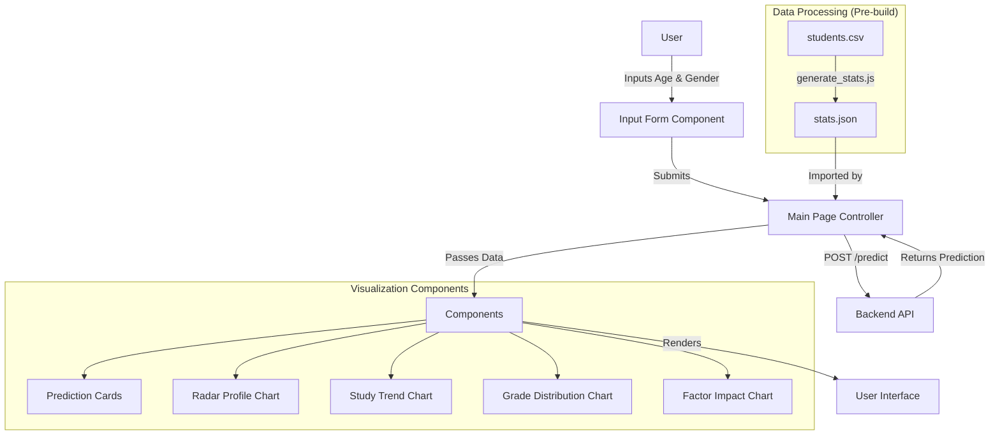

# Student Performance AI

A Next.js frontend application that predicts student performance and visualizes analytical trends based on demographic and behavioral data.

## Project Architecture



## Setup Instructions

### Prerequisites
- Node.js (v18 or higher recommended)
- npm

### Installation

1. Navigate to the frontend directory:
   ```bash
   cd student-performance-frontend
   ```

2. Install dependencies:
   ```bash
   npm install
   ```

3. (Optional) Regenerate statistics:
   If you modify `data/students.csv`, regenerate the lightweight stats file:
   ```bash
   node scripts/generate_stats.js
   ```

### Running the Application

1. Start the development server:
   ```bash
   npm run dev
   ```

2. Open [http://localhost:3000](http://localhost:3000) in your browser.

### Building for Production

1. Build the application:
   ```bash
   npm run build
   ```

2. Start the production server:
   ```bash
   npm start
   ```

## Key Features

- **Performance Prediction**: Predicts GPA, Grade Class, and other metrics based on minimal input.
- **Interactive Visualizations**:
    - **Radar Chart**: Compares the student's profile against the population average.
    - **Trend Analysis**: Visualizes how study time affects GPA.
    - **Distribution**: Shows the prevalence of different grade classes.
    - **Factor Impact**: Analyzes the effect of parental education on performance.
- **Responsive Design**: Optimized for both desktop and mobile devices.
